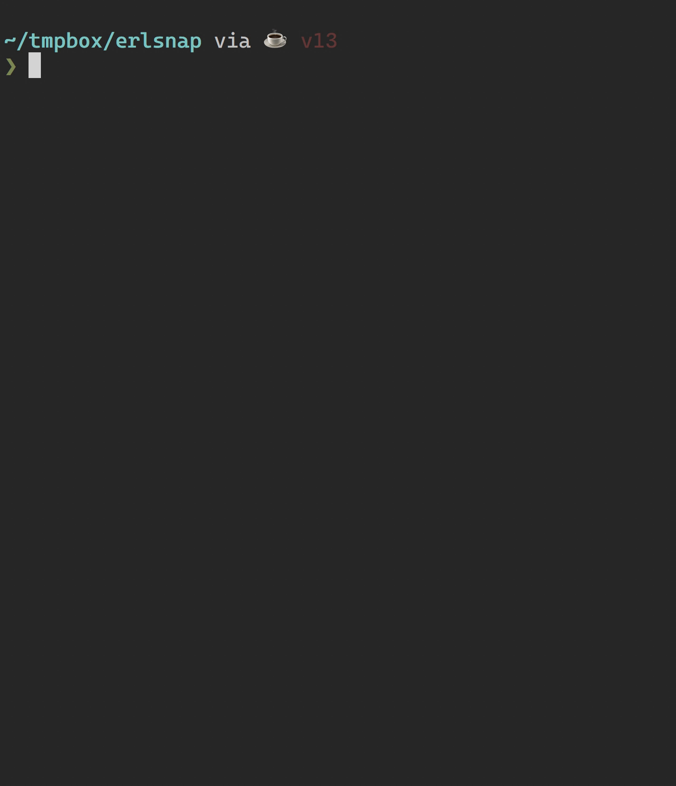

**SSS - so stupid search <Primitive's command line text tool>**
---
"so stupid search" is a tool built for himself by a programmer who believes in minimalism. He always reminds himself to cherish his time and let himself spend every minute in simplicity and happiness

---
「so stupid search」は、ミニマリズムを信じるプログラマーが自分のために作ったツールで、いつも自分の時間を大切にし、シンプルさと幸せに毎分費やすように心がけています。

---
"So stupid search"는 미니멀리즘을 믿는 프로그래머가 자신을 위해 만든 도구입니다. 그는 항상 자신의 시간을 소중히 여기고 단순함과 행복 속에 매 순간을 보내도록 자신을 상기시킵니다.

---
«so stupid search» - это инструмент, созданный для себя программистом, который верит в минимализм. Он всегда напоминает себе, что нужно ценить свое время и позволять себе тратить каждую минуту в простоте и счастье.

---
"so stupid search" är ett verktyg som byggts för sig själv av en programmerare som tror på minimalism. Han påminner sig alltid om att värna om sin tid och låta sig spendera varje minut i enkelhet och lycka.

[](https://gitter.im/cpp2x-rust-zig/community?utm_source=badge&utm_medium=badge&utm_campaign=pr-badge&utm_content=badge)



# English Documentation

## install

### install from source code
1.install rust toolchain
```bash
curl --proto '=https' --tlsv1.2 -sSf https://sh.rustup.rs | sh
```
2.build and install in one command
```bash
cargo install --git https://github.com/Lispre/so_stupid_search.git
```
---
**Warning**

If you are living in SOME specifily area(China mainland), you should do as follow to build and install, because you are live behind GFW that network is ... ...
> 1.Download the file
>```bash
>git clone https://github.com/Lispre/so_stupid_search.git
>```
>2.Enter the directory contains file with name of "Cargo.toml" and Run command as blow:
>```bash
>cd so_stupid_search
>cargo build --release
>```
>3.Then you will get the executable file "so_stupid_search/target/release/sss"

>4.move the executable file sss to your $PATH directory
>```bash
>sudo mv ./target/release/sss /usr/local/bin/
>```

## Usage
### search file system
```bash
  sss search-string start-directory
```
### filter command pipe
```bash
  command | sss pattern-string
```

## Example

### common search
```bash
sss "func main(" .
```

### search specified type of file
```bash
#only search in kubernetes yaml files
sss -t yaml fuck_str .
```
 
# 中文文档

## 安装
### 从源代码构建安装
1.安装rust编译器
```bash
curl --proto '=https' --tlsv1.2 -sSf https://sh.rustup.rs | sh
```
2.下载so_stupid_search源代码
```bash
git clone https://github.com/Lispre/so_stupid_search.git
```
3.进入源码根目录进行构建
```bash
cd so_stupid_search
cargo build --release
```

4.获得可执行文件 "so_stupid_search/target/release/sss"

5.将sss可执行文件复制到 $PATH 变量包含的一个目录中
```bash
sudo mv ./target/release/sss /usr/local/bin/
```
6.现在你就可以像阿Q一样使用sss了
